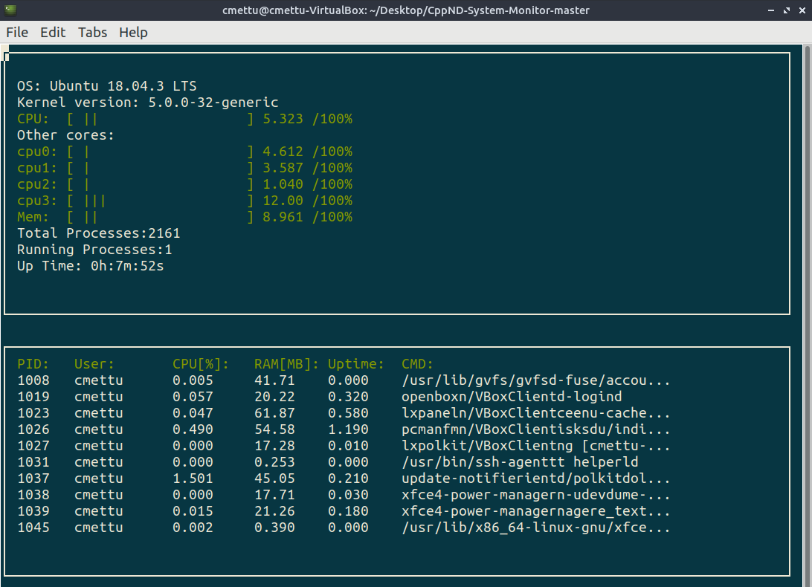

# Linux System Monitor
This project provides a text-based graphical output in the terminal to monitor system processes on Linux. The ncurses library facilitates the display output.



## Install Dependencies
```
sudo apt-get install libncurses5-dev libncursesw5-dev
```
## Compilation and Execution
```
cd src
g++ *.cpp -lncurses
./a.out
```
